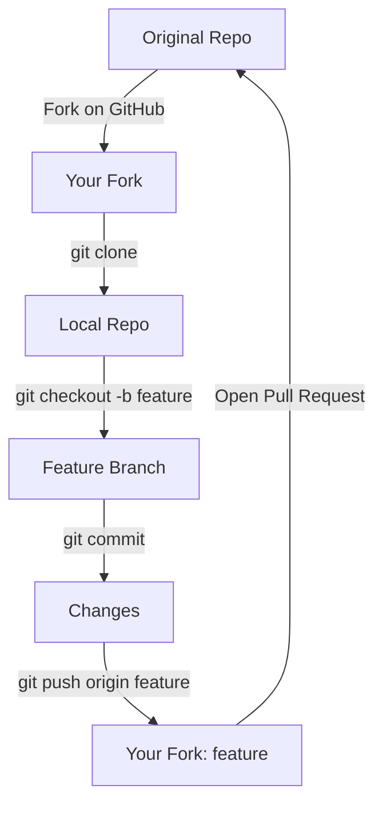

## `git fork` vs. **Forking on GitHub/GitLab/etc.**

Git itself **does not have a `git fork` command**.  
The term **“fork”** belongs to the **hosting platform** (GitHub, GitLab, Bitbucket, etc.).

| Concept | Where it lives | What it does |
|---------|----------------|--------------|
| **Platform Fork** | GitHub / GitLab UI (or API) | Creates **your own copy** of a repository under your account. You can push changes, open PRs, etc. |
| **Git Clone** | Local `git` | Downloads a repo (whether it’s the original or your fork). |

---

## Step-by-Step: Fork + Clone + Work + PR



### 1. **Fork on the website**
1. Go to `https://github.com/owner/repo`
2. Click **Fork** → **your-account**
3. Wait → you now have `https://github.com/your-user/repo`

### 2. **Clone *your* fork**
```bash
git clone https://github.com/your-user/repo.git
cd repo
```

### 3. **Add the original as “upstream” (optional but recommended)**
```bash
git remote add upstream https://github.com/owner/repo.git
git fetch upstream
```

### 4. **Create a branch & work**
```bash
git checkout -b my-cool-feature
# edit files...
git add .
git commit -m "Add cool feature"
```

### 5. **Push to *your* fork**
```bash
git push origin my-cool-feature
```

### 6. **Open a Pull Request**
- Go to your fork on GitHub.
- Click **Compare & pull request**.
- Fill in details → **Create pull request**.

---

## Syncing Your Fork with Upstream

```bash
# From your local repo (on main/master)
git checkout main
git fetch upstream
git reset --hard upstream/main   # careful: discards local changes
git push --force-with-lease origin main
```

---

## Common Commands Cheat-Sheet

| Goal | Command |
|------|---------|
| Clone your fork | `git clone https://github.com/your-user/repo.git` |
| Add original repo | `git remote add upstream https://github.com/owner/repo.git` |
| Update local main | `git checkout main && git pull upstream main` |
| Rebase feature branch | `git checkout my-feature && git rebase main` |
| Push branch | `git push origin my-feature` |
| Delete local branch | `git branch -d my-feature` |
| Delete remote branch | `git push origin --delete my-feature` |

---

## TL;DR

```bash
# 1. Fork on GitHub → get https://github.com/your-user/repo
git clone https://github.com/your-user/repo.git
cd repo
git remote add upstream https://github.com/owner/repo.git
git checkout -b fix-bug
# …make changes…
git commit -am "Fix bug"
git push origin fix-bug
# → Open PR from GitHub UI
```


----

When you fork someone's repository on a platform like GitHub, you get a copy of the repository in your account. This is the standard way to contribute to someone else's open-source project. The steps are typically:

1. Fork their repo into your account
2. Clone your fork to your local machine
3. Create a new branch (let's call it `your_feature`)
4. Make changes
5. Commit and push changes to your fork's remote `your_feature` branch
6. Create a pull request to `original_owner/repo` `main` from `your_username/repo` `your_feature`

Then the original owner can review your changes. If they like them, they can merge the changes straight from your fork into their repository.

##### Tags : [[0 - Git 🍋‍🟩]]