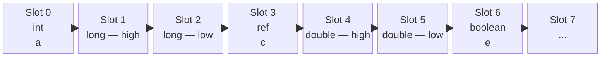

> **Every local variable, regardless of type, lives inside a single array (the Local Variable Array) that is part of the frame.**

- `int`, `float`, `boolean`, `char`, `byte`, `short` → **1 slot each**
- `long`, `double` → **2 slots each**
- Every object reference (`String`, `Person`, `int[]`, ...) → **1 slot each**

All of them are just **slots in one array**.

---

## The Clarification: "Variable" vs "Object"

There's a subtle but important distinction:

| Thing | Where it lives |
|-------|----------------|
| The **local variable itself** | ✅ Inside the Local Variable Array (in the frame, on the stack) |
| The **object it points to** | ❌ On the Heap — **not** in the frame |

So when you write:

```java
Person p = new Person();
```

- The **variable `p`** (a reference, 1 slot) → inside the Local Variable Array
- The **`Person` object** → on the Heap

The frame's array holds the *reference*, not the object.

---

## One Array, All Types Mixed Together

It's worth stressing: it's **one array**, not one array per type. Slots of different types sit side by side.

```java
void example(int a, long b, String c, double d) {
    boolean e = true;
    // ...
}
```



All in **one contiguous array**. The JVM doesn't segregate by type.

---

## Why "One Array" and Not Separate Storage?

Because the JVM needs a **single, uniform, index-addressable** structure so bytecode can say:

```
iload_0     → read slot 0 as int
lload_1     → read slots 1-2 as long
aload_3     → read slot 3 as reference
dload_4     → read slots 4-5 as double
```

One array + index + type-prefixed instruction = fast, simple, compact.

---

## A Precise Mental Model

```
Thread
└── JVM Stack
    └── Frame (one per method call)
        ├── Local Variable Array   ← ONE array, holds ALL locals as slots
        │   └── [slot0, slot1, slot2, ...]   ← ints, longs, refs all mixed
        ├── Operand Stack          ← separate region, same slot rules
        └── Frame Data             ← PC, constant pool ref, etc.
```

The **objects** those reference-slots point to live elsewhere (Heap), but the **variables themselves** — every single one, every type — live as slots in that one array inside the frame.

---

## TL;DR

> ✅ **Every local variable of every type goes into one array — the Local Variable Array — inside the frame.**
>
> ✅ Each variable occupies 1 or 2 consecutive slots in that array.
>
> ⚠️ **Exception:** if the variable is a reference, the *object* it points to is on the Heap — only the *reference* is in the array.

So your statement is correct, with the small addition that references store *pointers*, not the objects themselves.


[[Java]]