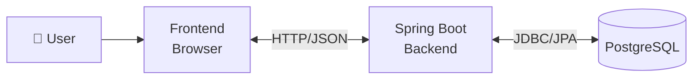

So far we've zoomed into the _inside_ of a Spring Boot app (controller → service → repository → domain). Now let's zoom **out** — how does the whole system look when you add a UI that real users interact with? This is the level architecture diagrams usually start at, before drilling into any single box.

---

## 1. The Big Picture — Client/Server Split

A modern web app is almost always split into two independently deployable pieces:

```
┌─────────────────────┐         HTTP/JSON         ┌──────────────────────┐
│                     │  ────────────────────►    │                      |
│    Frontend (UI)    │                           │  Spring Boot Backend │
│(runs in the browser)│  ◄────────────────────    │  (runs on a server)  |
│                     │        REST API           │                      │
└─────────────────────┘                           └───────────┬──────────┘
                                                              │
                                                              ▼
                                                          ┌─────────────────┐
                                                          │     Database    │
                                                          │(PostgreSQL etc) │
                                                          └─────────────────┘
```

Two separate applications, two separate codebases, two separate deployments — talking to each other purely over HTTP. This is the standard shape almost every real product uses today (as opposed to old-style server-rendered apps where the server builds the HTML page directly).




---

## 2. Why Split Them at All?

This connects back to Separation of Concerns from the last tutorial:

|Reason|Explanation|
|---|---|
|**Independent scaling**|If UI traffic spikes but backend load doesn't, scale the frontend hosting alone (e.g., a CDN) without touching backend servers|
|**Independent deployment**|Ship a UI bugfix without redeploying the whole backend, and vice versa|
|**Multiple clients, one backend**|The same Spring Boot API can serve a web UI, a mobile app, and a future admin dashboard — all hitting the same endpoints|
|**Team boundaries**|Frontend and backend devs work in parallel without stepping on each other's code|

---

## 3. Where the UI Actually Lives

For a Java/Spring Boot learner, there are three realistic options — worth knowing all three exist, even if you only use one right now.

### Option A — Separate Frontend App (most common today)

A completely separate project, usually React, Vue, or Angular, that:

- Runs on its own (e.g., `localhost:3000` in dev, or a CDN in production)
- Calls your Spring Boot API purely via `fetch`/`axios` HTTP requests
- Knows nothing about Java — it just consumes JSON

```
library-frontend/          (separate repo, e.g. React + Vite)
├── src/
│   ├── components/
│   ├── pages/
│   └── api/
│       └── bookApi.js      → calls http://localhost:8080/books
```

This is what "full-stack" usually means in industry today — a Spring Boot backend + a JS frontend, deployed separately.

### Option B — Server-Side Rendered UI with Thymeleaf (classic Spring approach)

Spring Boot renders HTML directly on the server, no separate frontend project. Good for simpler apps or when you want to stay 100% in Java while learning.

```java
@Controller  // note: @Controller, not @RestController — returns view names, not JSON
public class BookViewController {
    private final BookService bookService;

    @GetMapping("/books")
    public String listBooks(Model model) {
        model.addAttribute("books", bookService.findAll());
        return "books"; // resolves to templates/books.html
    }
}
```

```
src/main/resources/templates/
└── books.html    (Thymeleaf template, HTML + server-side expressions)
```

No separate frontend build, no JSON API needed for the UI itself — the browser gets fully-formed HTML. Simpler to start with, but doesn't scale well to complex interactive UIs or mobile clients later.

### Option C — Same-Repo, Separate Build (common middle ground)

A React/Vue app lives in the _same_ repository, gets built into static files, and Spring Boot serves those static files directly — one deployable artifact, but still architecturally a separate frontend talking to the API over HTTP internally.

```
library-app/
├── backend/          (Spring Boot)
└── frontend/          (React) → built output copied into backend/src/main/resources/static/
```

---

## 4. Which Should You Pick, Learning Java/Spring Boot?

Given where you are — learning Java and Spring Boot specifically — **Option A (separate frontend) or Option B (Thymeleaf) are both reasonable starting points**, but for different goals:

|If your goal is...|Pick|
|---|---|
|Deeply learn Spring Boot as a backend/API skill (most valuable for jobs)|**Option A** — build the API only, test it with Postman/curl, skip UI entirely at first|
|See something visual quickly, stay 100% in Java|**Option B** — Thymeleaf, no separate frontend to learn|
|Build a portfolio-ready full-stack app eventually|**Option A**, once comfortable — pair it with basic React later|

My honest recommendation while you're still learning Spring Boot fundamentals: **build the REST API first, without any UI at all.** Test everything with a tool like **Postman**, **curl**, or Spring Boot's own `.http` files in IntelliJ. This forces you to master the backend architecture (everything we've covered so far) without frontend complexity muddying the learning. Add a UI _after_ the API is solid.

---

## 5. Where Authentication Fits (a preview, not full detail yet)

Once a UI enters the picture, a new architectural question appears: **how does the frontend prove who the user is on every request?** High-level shape, using our Library domain:

```
1. Member logs in (POST /auth/login with email+password)
   → Backend verifies, returns a JWT (a signed token)
2. Frontend stores the JWT (e.g., in memory or an httpOnly cookie)
3. Every subsequent request (e.g., POST /loans) includes the JWT
   → Backend validates the token, identifies the Member, proceeds
```

This is a full topic on its own (Spring Security + JWT) — flagging it now just so the architecture diagram has a place for it. We can go deep into this whenever you're ready.

---

## 6. Full High-Level Diagram (Library App, Option A)

```
┌─────────────────────────┐
│    React Frontend       │
│  (localhost:3000, dev)  |
│                         |   
│  - Book search page     |     
│  - "My Loans" page      |       
│  - Login page           |        
└───────────┬─────────────┘
             │  HTTP + JSON (REST API calls)
             │  Authorization: Bearer <JWT>
             ▼
┌─────────────────────────┐
│   Spring Boot Backend   |    
│  (localhost:8080)       |     
│                         |    
│  Controller → Service → |      
│  Repository → Domain    |       
└───────────┬─────────────┘
             │  JDBC
             ▼
┌─────────────────────────┐
│    PostgreSQL Database  |
└─────────────────────────┘
```

Each box here is something we've already built the _inside_ of, in earlier tutorials — this diagram is just the map showing how they connect.

---

## Quick summary

1. Modern apps split into **frontend** (browser) and **backend** (Spring Boot API) as separate, independently deployable pieces talking over HTTP/JSON
2. Three real options for the UI: separate JS frontend (industry standard), Thymeleaf server-rendered (simplest while learning Java), or same-repo hybrid
3. **While learning Spring Boot, build the API first — test with Postman, skip the UI** — this isolates backend learning from frontend complexity
4. Authentication (JWT) is the bridge that lets the frontend prove _who's_ making each API call — a topic for later

---


[[Java]]
[[0 - Spring Framework]]