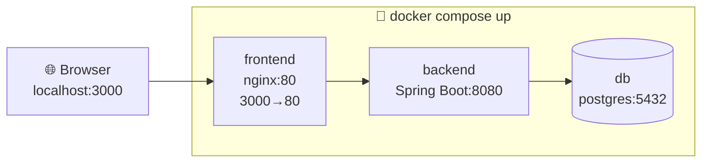

We've talked about the high-level architecture (frontend + Spring Boot + database) but so far everything's been theoretical. Let's make it real: **Docker Compose** is how you run your entire stack — database, backend, and UI — with one command, on your Debian machine.

---

## 1. Why Docker Compose (the problem it solves)

Right now, to run our Library app locally you'd need to:

1. Install and configure PostgreSQL manually
2. Set up a database, user, and permissions by hand
3. Run your Spring Boot app separately
4. Run your frontend dev server separately
5. Make sure all three can find each other

Every teammate (or future-you, six months later) has to repeat this setup, and it inevitably drifts — "works on my machine" syndrome. **Docker Compose defines your entire stack as code**, in one file, so anyone can spin it up identically with a single command.

```
docker compose up
```

That's the entire "getting started" instruction for anyone joining the project.

---

## 2. Core Concepts (know these before writing the file)

|Term|Meaning|
|---|---|
|**Image**|A packaged snapshot of an app + its dependencies (e.g., `postgres:16`, or your built Spring Boot app)|
|**Container**|A running instance of an image|
|**Service**|One entry in `docker-compose.yml` — usually maps to one container (e.g., `db`, `backend`, `frontend`)|
|**Volume**|Persistent storage that survives container restarts (critical for your database!)|
|**Network**|Lets containers talk to each other by service name instead of IP|
|**Dockerfile**|Instructions for _building_ a custom image (needed for your own Spring Boot app; not needed for off-the-shelf images like `postgres`)|

---

## 3. Step 1 — Dockerfile for the Spring Boot Backend

Before Compose can run your app, it needs an **image** of it. Multi-stage builds are the standard, clean pattern — build in one stage, run in a lean second stage:

```dockerfile
# ---- Stage 1: Build ----
FROM eclipse-temurin:21-jdk AS build
WORKDIR /app
COPY . .
RUN ./mvnw clean package -DskipTests

# ---- Stage 2: Run ----
FROM eclipse-temurin:21-jre
WORKDIR /app
COPY --from=build /app/target/*.jar app.jar
EXPOSE 8080
ENTRYPOINT ["java", "-jar", "app.jar"]
```

**Why two stages:** the build stage needs the full JDK + Maven wrapper + your source code (heavy — hundreds of MB). The final image only needs the JRE + the compiled `.jar` (much lighter). Docker discards the build stage's bulk, keeping your shipped image small.

Save this as `Dockerfile` in your Spring Boot project root.

---

## 4. Step 2 — `docker-compose.yml` — Backend + Database First

Start simple — just the two pieces we've built so far (Spring Boot + PostgreSQL):

```yaml
services:
  db:
    image: postgres:16
    environment:
      POSTGRES_DB: library
      POSTGRES_USER: library_user
      POSTGRES_PASSWORD: library_pass
    ports:
      - "5432:5432"
    volumes:
      - db-data:/var/lib/postgresql/data

  backend:
    build: .
    depends_on:
      - db
    environment:
      SPRING_DATASOURCE_URL: jdbc:postgresql://db:5432/library
      SPRING_DATASOURCE_USERNAME: library_user
      SPRING_DATASOURCE_PASSWORD: library_pass
    ports:
      - "8080:8080"

volumes:
  db-data:
```

### Key things to understand here

**`services`** — each top-level key (`db`, `backend`) becomes its own container.

**`image: postgres:16`** vs **`build: .`** — `db` pulls a ready-made image from Docker Hub; `backend` builds from your `Dockerfile` in the current directory (`.`).

**Service-name networking** — notice the datasource URL is `jdbc:postgresql://db:5432/library`, not `localhost`. Docker Compose creates an internal network where **the service name (`db`) acts as the hostname**. This is the single most confusing thing for beginners: inside Compose, containers talk to each other by service name, never `localhost`.

**`depends_on`** — ensures `db` _starts_ before `backend`. Important caveat: this only waits for the container to start, not for Postgres to be _ready to accept connections_ — Spring Boot's connection retry usually handles the small gap, but for stricter guarantees you'd add a `healthcheck` (shown below).

**`volumes: db-data:`** — without this, every time you run `docker compose down`, your entire database is wiped. The volume persists data on disk, outside the container's lifecycle.

**`ports: "8080:8080"`** — format is `"host:container"`. The left side is what you type in your browser (`localhost:8080`); the right side is what the app inside the container listens on.

---

## 5. Step 3 — Adding the UI to Compose

Back to our earlier UI architecture tutorial — let's add **Option A (separate React frontend)** into the same Compose file.

### Frontend Dockerfile (multi-stage again — build the static files, serve with nginx)

```dockerfile
# ---- Stage 1: Build ----
FROM node:20 AS build
WORKDIR /app
COPY package*.json ./
RUN npm install
COPY . .
RUN npm run build

# ---- Stage 2: Serve ----
FROM nginx:alpine
COPY --from=build /app/dist /usr/share/nginx/html
EXPOSE 80
```

Same pattern as the backend: build stage has Node + all dependencies (heavy), final stage is just nginx serving static files (light).

### Add it to `docker-compose.yml`

```yaml
services:
  db:
    image: postgres:16
    environment:
      POSTGRES_DB: library
      POSTGRES_USER: library_user
      POSTGRES_PASSWORD: library_pass
    volumes:
      - db-data:/var/lib/postgresql/data
    healthcheck:
      test: ["CMD-SHELL", "pg_isready -U library_user"]
      interval: 5s
      timeout: 5s
      retries: 5

  backend:
    build: ./backend
    depends_on:
      db:
        condition: service_healthy
    environment:
      SPRING_DATASOURCE_URL: jdbc:postgresql://db:5432/library
      SPRING_DATASOURCE_USERNAME: library_user
      SPRING_DATASOURCE_PASSWORD: library_pass
    ports:
      - "8080:8080"

  frontend:
    build: ./frontend
    depends_on:
      - backend
    ports:
      - "3000:80"

volumes:
  db-data:
```

Notice the `healthcheck` on `db` — this is the stricter version of `depends_on` mentioned above: `backend` now waits until Postgres actually reports itself ready (`pg_isready`), not just "container started."

### Project layout this assumes

```
library-app/
├── docker-compose.yml
├── backend/
│   ├── Dockerfile
│   ├── src/
│   └── pom.xml
└── frontend/
    ├── Dockerfile
    ├── src/
    └── package.json
```

This is the "same-repo, separate build" pattern (Option C) from the earlier UI tutorial — one repo, one `docker compose up`, but architecturally still two independent services talking over HTTP.

---

## 6. Step 4 — Frontend Talking to Backend, From Inside the Browser

Here's a subtlety that trips people up: **service-name networking (`db`, `backend`) only works _between containers_.** The browser on your Debian machine is _not_ inside the Docker network — so your React app's API calls must use `localhost:8080`, not `http://backend:8080`.

```javascript
// frontend/src/api/bookApi.js
const API_BASE = "http://localhost:8080";

export async function getBooks() {
  const res = await fetch(`${API_BASE}/books`);
  return res.json();
}
```

The rule: **backend-to-backend** communication inside Compose uses service names (`db`); **browser-to-backend** communication uses `localhost` + the mapped port, because the browser lives outside the Docker network entirely.

---

## 7. Running It

```bash
# Build images and start everything
docker compose up --build

# Run in the background
docker compose up -d

# Stop everything (keeps volumes/data)
docker compose down

# Stop AND wipe the database volume
docker compose down -v

# View logs for one service
docker compose logs -f backend
```

On Debian 13, you'll want Docker Engine + the Compose plugin installed (not the old standalone `docker-compose` binary — `docker compose`, with a space, is the modern CLI plugin):

```bash
sudo apt update
sudo apt install docker.io docker-compose-v2
sudo systemctl enable --now docker
```

You may also need to add your user to the `docker` group so you don't need `sudo` for every command:

```bash
sudo usermod -aG docker $USER
# then log out and back in
```

---

## 8. Environment-Specific Config — Don't Hardcode Secrets

Hardcoding `library_pass` directly in `docker-compose.yml` is fine for local learning, but the standard next step is externalizing it into a `.env` file:

```
# .env (add this to .gitignore — never commit real secrets!)
DB_NAME=library
DB_USER=library_user
DB_PASSWORD=library_pass
```

```yaml
services:
  db:
    image: postgres:16
    environment:
      POSTGRES_DB: ${DB_NAME}
      POSTGRES_USER: ${DB_USER}
      POSTGRES_PASSWORD: ${DB_PASSWORD}
```

Docker Compose automatically reads `.env` in the same directory — no extra config needed. This also ties back to the NFR we wrote way back in the Requirements tutorial: _"business rules must be configurable, not hardcoded"_ — the same principle applies to infrastructure config, not just business logic.

---

## 9. Full Picture — What You Now Have



One command, three containers, wired together exactly as designed in our High-Level Architecture tutorial — but now actually runnable on your Debian machine instead of just a diagram.

---

## Quick Summary

1. **Dockerfile** = how to build one image (multi-stage: heavy build stage → lean run stage)
2. **docker-compose.yml** = how multiple containers (db, backend, frontend) run together and talk to each other
3. **Service names** (`db`, `backend`) are hostnames _inside_ the Docker network — the browser must still use `localhost` + mapped port
4. **Volumes** persist your database across restarts — without one, `docker compose down` wipes your data
5. **`healthcheck` + `depends_on: condition: service_healthy`** ensures the backend doesn't start before Postgres is truly ready
6. Externalize secrets into a `.env` file — never hardcode passwords in `docker-compose.yml` for anything beyond quick local learning

---


[[1 - Docker 🧋]]
[[Java]]
[[0 - Spring Framework]]