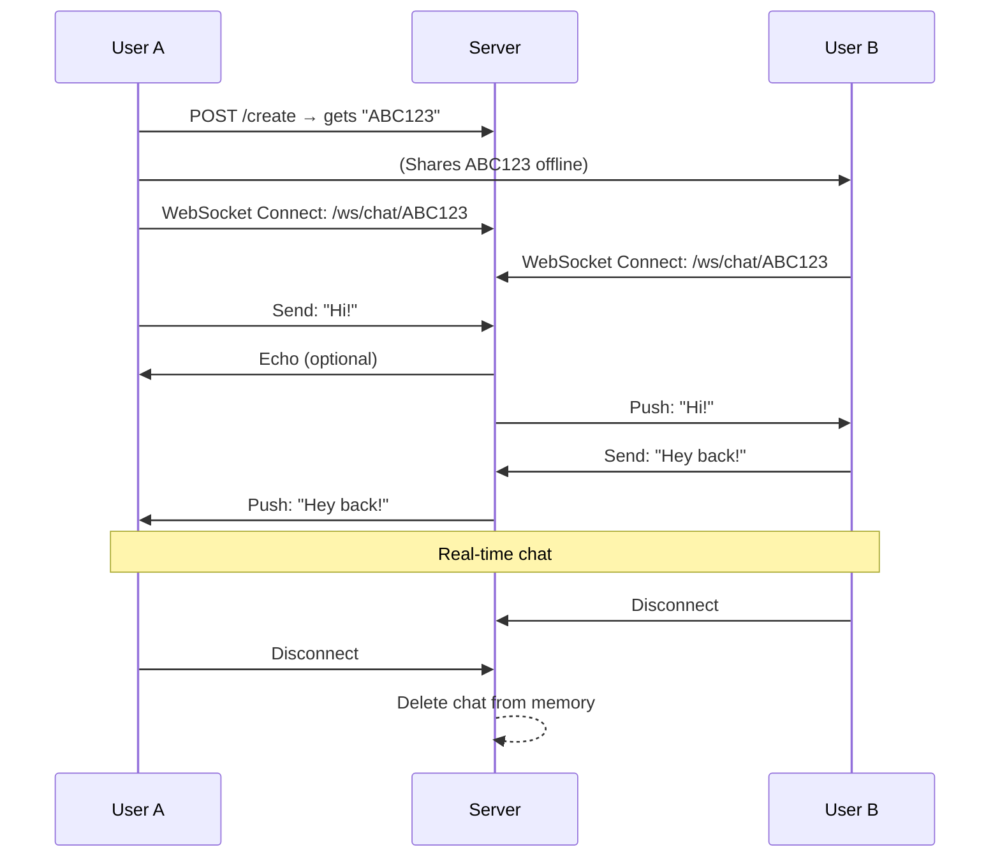

Great question! Let’s break down **how real-time messaging works in social media apps** (like WhatsApp, Facebook Messenger, Instagram DMs, etc.) — and how **your `ArcadeSocial` app can use similar principles**, but **simpler and more private**.

---

## How Social Media Apps Send Messages (High-Level)

| Step | What Happens |
|------|-------------|
| 1. **User A types a message** | Frontend captures input |
| 2. **Message sent to server** | Via **WebSocket** or **HTTP POST** |
| 3. **Server identifies the chat/session** | Using `chatId`, `userId`, or `tempId` (in your case) |
| 4. **Server finds online recipients** | Checks who is **connected** to that chat |
| 5. **Server pushes message to User B** | Via **WebSocket** (real-time) |
| 6. **User B receives & displays message** | Instantly, no refresh needed |

---

## Real-Time Messaging: **WebSocket** (The Magic)

> **WebSocket = Full-duplex, persistent connection**  
> Unlike HTTP (request → response), WebSocket keeps a **live tunnel open** between client and server.

```text
Client A ←──────WebSocket──────→ Server ←──────WebSocket──────→ Client B
       ↑                         ↑                         ↑
   Send message              Route to chat           Push to B
```

---

## How **ArcadeSocial** Can Do It (Simple & Secure)

### 1. **Generate Temp ID (Chat Room)**
```java
POST /api/chat/create → { "tempId": "X7K9-P2M1" }
```

### 2. **Both Users Connect via WebSocket**
```ws
ws://yourapp.com/ws/chat/X7K9-P2M1
```

### 3. **Send Message (JSON)**
```json
{
  "type": "MESSAGE",
  "content": "Hey, you there?",
  "timestamp": "2025-11-12T10:00:00Z"
}
```

### 4. **Server Broadcasts to All in Same `tempId`**
```java
// In Spring Boot (WebSocket + STOMP)
@MessageMapping("/chat/{tempId}")
@SendTo("/topic/chat/{tempId}")
public ChatMessage send(@DestinationVariable String tempId, ChatMessage msg) {
    return msg;
}
```

### 5. **Frontend Subscribes**
```js
stompClient.subscribe('/topic/chat/X7K9-P2M1', (msg) => {
    showMessage(JSON.parse(msg.body).content);
});
```

---

## Your `ArcadeSocial` Flow (Simplified)



---

## Key Tech in **Spring Boot** (What You Need)

```xml
<!-- pom.xml -->
<dependency>
    <groupId>org.springframework.boot</groupId>
    <artifactId>spring-boot-starter-websocket</artifactId>
</dependency>
```

```java
@Configuration
@EnableWebSocketMessageBroker
public class WebSocketConfig implements WebSocketMessageBrokerConfigurer {
    @Override
    public void registerStompEndpoints(StompEndpointRegistry registry) {
        registry.addEndpoint("/ws").setAllowedOriginPatterns("*").withSockJS();
    }

    @Override
    public void configureMessageBroker(MessageBrokerRegistry registry) {
        registry.enableSimpleBroker("/topic");
        registry.setApplicationDestinationPrefixes("/app");
    }
}
```

```java
@Controller
public class ChatController {

    private final Map<String, ChatSession> activeChats = new ConcurrentHashMap<>();

    @MessageMapping("/chat/{tempId}")
    @SendTo("/topic/chat/{tempId}")
    public ChatMessage send(@DestinationVariable String tempId, ChatMessage message) {
        activeChats.get(tempId).updateLastActive();
        return message;
    }
}
```

---

## Privacy Bonus: **No Database = No Trace**

| Traditional Apps | **ArcadeSocial** |
|------------------|------------------|
| Save messages in DB | Only in `ConcurrentHashMap` |
| Keep chat history | Delete on last disconnect |
| Log user IPs | **Don’t log anything** |
| Allow message recovery | **Impossible** |

---

## Summary: How Messages "Travel"

| Layer | Tech |
|------|------|
| **Transport** | WebSocket (over TLS) |
| **Routing** | By `tempId` (like a chat room) |
| **Storage** | In-memory only (`Map<tempId, List<Message>>`) |
| **Delivery** | Broadcast to all connected clients |
| **Cleanup** | `@Scheduled` task + on-disconnect hook |

---

### Pro Tip for ArcadeSocial
Add a **heartbeat** every 30 seconds:
```json
{ "type": "PING" }
```
→ So server knows who’s still online  
→ Delete chat when **zero users** remain

---

[[Read Projects]]