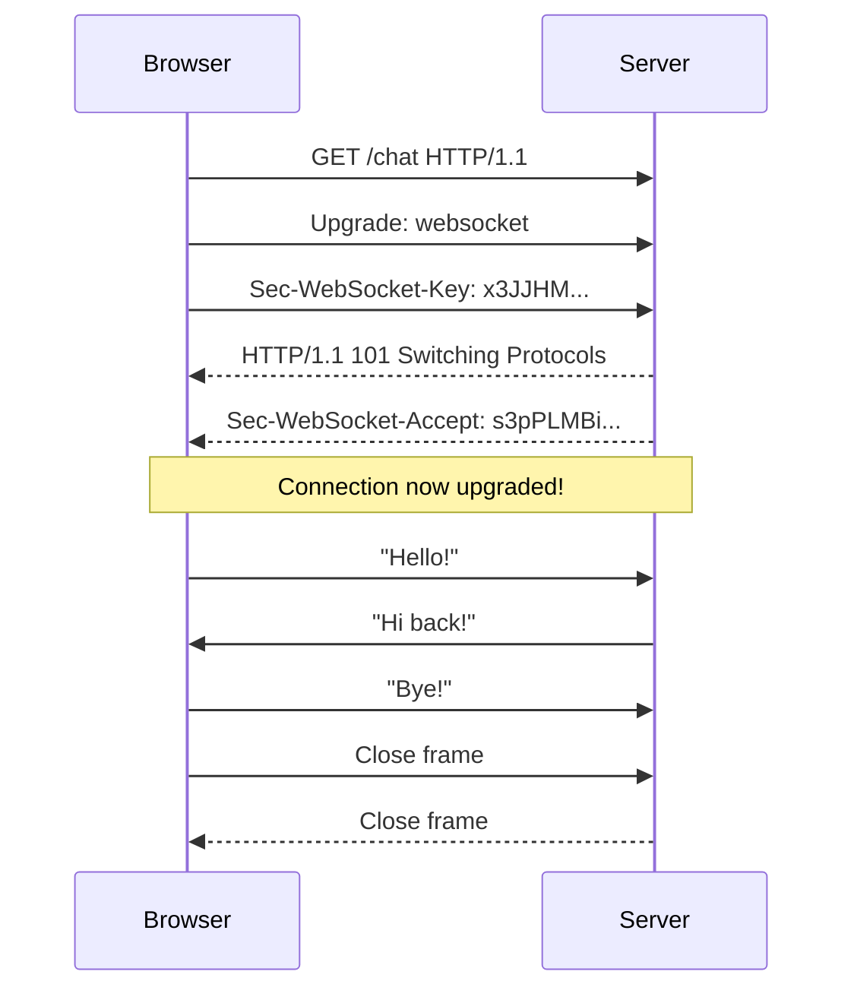

## What is a **WebSocket**?

**WebSocket** is a **communication protocol** that provides **full-duplex** (two-way) communication channels over a **single, long-lived TCP connection**.

![[Pasted image 20251113121011.png]]

---

### In Simple Terms:

> **WebSocket = A persistent, real-time tunnel between your browser (or app) and the server.**

Unlike regular **HTTP** (where you request → get response → connection closes), **WebSocket keeps the connection open** so both sides can send messages **anytime**, instantly.

---

## HTTP vs WebSocket

| Feature | **HTTP** | **WebSocket** |
|--------|--------|----------------|
| Connection | Short-lived (request → response) | Long-lived (stays open) |
| Direction | Client → Server only (unless polling) | **Both ways** (client ↔ server) |
| Real-time | No (need polling or long-polling) | Yes — instant push |
| Overhead | High (headers every request) | Low (after handshake) |
| Use Case | Loading pages, APIs | Chat, live notifications, games |

---

## How WebSocket Works (Step-by-Step)



1. **Handshake** – Browser sends a special HTTP request with `Upgrade: websocket`
2. **Server agrees** → returns `101 Switching Protocols`
3. **Connection stays open** – now both can send messages freely
4. **Messages are frames** – small, fast, no headers
5. **Close** – either side sends a "close frame"

---

## Why WebSocket is Perfect for **ArcadeSocial**

| Your Need | WebSocket Solves It |
|---------|---------------------|
| Real-time chat | Messages appear instantly |
| No polling | No wasted requests every second |
| Low latency | Direct push from server |
| Works in browsers | Native support (or fallback via SockJS) |
| Anonymous & ephemeral | Connection dies → chat can be deleted |

---

## WebSocket in Your App (Example)

```js
// Browser (frontend)
const socket = new WebSocket("ws://localhost:8080/ws/chat/X7K9P2M1");

socket.onopen = () => console.log("Connected!");
socket.onmessage = (event) => {
  console.log("New message:", event.data);
};
socket.send("Hello from the void!");
```

```java
// Server (Spring Boot)
@MessageMapping("/chat/{tempId}")
@SendTo("/topic/chat/{tempId}")
public String handle(String message) {
    return message; // broadcast to all in the room
}
```

---

## Key Features

| Feature | Meaning |
|-------|--------|
| **Full-duplex** | Both sides send at the same time |
| **Persistent** | One connection for the whole chat |
| **Low overhead** | After handshake, messages are tiny |
| **Secure** | Use `wss://` (WebSocket over TLS) |
| **Cross-platform** | Works in browsers, iOS, Android, desktop |

---

## When to Use WebSocket?

**YES**
- Chat apps (like ArcadeSocial)
- Live notifications
- Real-time dashboards
- Multiplayer games
- Collaborative editing

**NO**
- Simple page loads
- File downloads
- SEO content

---

## Real-World Examples

| App | Uses WebSocket? |
|-----|-----------------|
| WhatsApp Web | Yes |
| Facebook Messenger | Yes |
| Slack | Yes |
| Discord | Yes |
| **ArcadeSocial** | **YES – core of real-time chat** |

---

## Summary: WebSocket in One Sentence

> **WebSocket turns the web from "request-response" into a real-time conversation.**

---

### For **ArcadeSocial**:
```text
User A ←──WebSocket──→ Server ←──WebSocket──→ User B
         "Hi!"  ←─────────────── Push ──────── "Hi back!"
```

**No database. No delay. No trace.**

That’s the power of WebSocket.


[[Read Projects]]