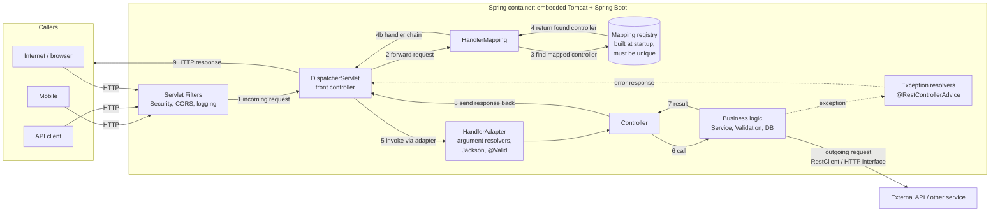
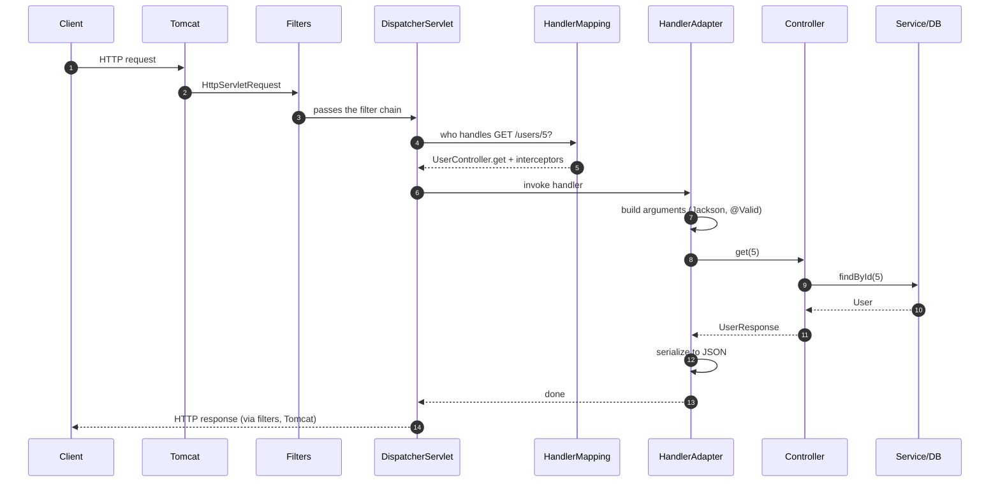

![[1791090768.jpg]]


## 1. What the picture shows

The dashed box is the **Spring container**: embedded Tomcat (the feather logo) plus Spring Boot (the green power button). Outside it are the three callers: Mobile, an API client, and the Internet. The numbers ①–⑨ are the order of events for one request. The right-hand box, "Mapping registry," explains the rule that endpoints must be **unique**.

Two things in the slide are simplified, and I'll flag them as we go:

- Step ⑤ makes it look like Handler Mapping calls the controller. In reality it only **finds** it. The DispatcherServlet calls it, through a HandlerAdapter.
- Arrow ⑨ is labelled "OUTGOING-REQUEST," but it is really the **HTTP response** leaving your app. This is a different use of "outgoing" than my earlier lesson (your app calling another service). I cover both in section 9.

## 2. The whole picture as Mermaid

Paste this into [mermaid.live](https://mermaid.live/), or into any Markdown viewer that supports Mermaid (GitHub, IntelliJ, VS Code with an extension).



And the same flow as a time sequence, which is often easier to read:



## 3. The callers (Mobile / API / Internet)

All three speak plain **HTTP**. Your app can't tell a phone from `curl`. It only sees method, URL, headers, and body. That's why one API serves every client.

```bash
curl -i -X POST http://localhost:8080/users \
  -H "Content-Type: application/json" \
  -d '{"username":"ali","email":"ali@example.com","password":"secret123"}'
```

## 4. The Spring container (Tomcat + Spring Boot)

**Analogy:** Tomcat is the building's front door and phone line. Spring Boot is the staff inside.

Tomcat speaks network and servlets. Spring Boot auto-configures everything else when you run `main`:

```java
@SpringBootApplication
public class DemoApplication {
    public static void main(String[] args) {
        SpringApplication.run(DemoApplication.class, args);  // starts Tomcat + Spring
    }
}
```

**Boot 4 change:** starters are now more modular. The web starter is named `spring-boot-starter-webmvc` and the JSON one is `spring-boot-starter-jackson`. Check the Boot 4 migration guide if you see the old `spring-boot-starter-web` name in tutorials. Spring Framework 7 and Jakarta Servlet 6.1 (Tomcat 11) are the base, and Java 17 is still the minimum.

## 5. ① Incoming request → ② Dispatcher Servlet

Tomcat turns raw bytes into an `HttpServletRequest`, passes it through **filters** (the slide omits these), then hands it to the **DispatcherServlet**. Step ② "Forward request" means the dispatcher asks HandlerMapping where to send it.

```java
// You never write this. Boot registers it for you, mapped to "/"
// DispatcherServlet ds = new DispatcherServlet(applicationContext);
```

You can watch it work with `logging.level.org.springframework.web=DEBUG`.

## 6. ③④ Handler Mapping and the Mapping registry

This is the heart of the slide.

**Analogy:** the registry is a phone directory built **when the app starts**. HandlerMapping looks a number up. If two people share one number, the directory refuses to print.

At startup, Spring scans every `@RequestMapping`-family annotation and builds a table (`RequestMappingHandlerMapping`):

```java
@RestController
@RequestMapping("/somepath")
public class DemoController {

    @GetMapping("/{name}/{id}")        // key: GET  /somepath/{name}/{id}
    public String get(@PathVariable String name, @PathVariable Integer id) { ... }

    @PostMapping("/{name}/{id}")       // key: POST /somepath/{name}/{id}   ✔ different method
    public String post(@PathVariable String name, @PathVariable Integer id) { ... }

    @GetMapping("/{who}/{number}")     // key: GET  /somepath/{who}/{number}   ✘ same pattern as the first
    public String clash(@PathVariable String who, @PathVariable Integer number) { ... }
}
```

The third method matches the slide's red ✘. The app **refuses to start**:

```
IllegalStateException: Ambiguous mapping. Cannot map 'demoController' method
... to {GET [/somepath/{who}/{number}]}: There is already 'demoController' bean method ... mapped.
```

**Correction to the slide:** the slide writes `[path variable (type)]`, but Spring does **not** use the Java type (`String` vs `Integer`) in the key. `{name}` and `{who}` are the same pattern. A request `/somepath/qqqq/1` fails _conversion_ later, not _matching_. For example, `/somepath/ali/abc` matches the pattern, then returns `400` because `abc` isn't an `Integer`.

**When similar-looking mappings are allowed** (the "why it works this way"): Spring picks the _most specific_ match, so literals beat variables:

```java
@GetMapping("/somepath/ali/{id}")      // literal "ali": wins for /somepath/ali/1
@GetMapping("/somepath/{name}/{id}")   // handles everyone else
```

Other conditions also make mappings distinct:

```java
@GetMapping(path = "/reports", produces = "application/json")
@GetMapping(path = "/reports", produces = "text/csv")   // distinguished by Accept header

@GetMapping(path = "/items", params = "active=true")
@GetMapping(path = "/items", params = "active=false")
```

**New in Boot 4 / Spring 7:** API **version** is now a built-in dimension of the key. Before Boot 4, teams built versioning by hand with URL prefixes, custom mappings, or interceptors, and there was no official answer. Now it's first-class.

```java
@GetMapping(path = "/users/{id}", version = "1")
public UserV1 getV1(@PathVariable Long id) { ... }

@GetMapping(path = "/users/{id}", version = "2")
public UserV2 getV2(@PathVariable Long id) { ... }
```

```properties
# choose where the version is read from, e.g. a request header
spring.mvc.apiversion.use.header=API-Version
```

Now the same path with different versions is **not** a clash.

## 7. ⑤ Controller (and the HandlerAdapter hiding in the slide)

HandlerMapping returns a **chain** (target method + interceptors) to the dispatcher. The dispatcher uses a **HandlerAdapter** to call it, and the adapter builds your arguments and handles the return value.

```java
@PostMapping("/users")
public ResponseEntity<UserResponse> create(@Valid @RequestBody CreateUserRequest req) {
    return ResponseEntity.status(201).body(service.create(req));
}
```

Controllers are deliberately **thin**: take HTTP in, delegate, return HTTP out.

## 8. ⑥⑦ Business logic ("Service – Validation – DB")

The slide's right-hand label lists what lives here. Valid input and business rules are separate:

```java
@Service
public class UserService {
    private final UserRepository repo;

    public UserService(UserRepository repo) { this.repo = repo; }

    @Transactional
    public UserResponse create(CreateUserRequest req) {
        if (repo.existsByEmail(req.email())) {                    // business rule
            throw new EmailAlreadyUsedException(req.email());     // → @ExceptionHandler → 409
        }
        User saved = repo.save(User.from(req));                   // DB
        return UserResponse.from(saved);
    }
}
```

- `@Valid` (format: not blank, valid email) is checked **before** your controller runs.
- Rules that need data ("is the email taken?") belong in the **service**.

## 9. ⑧ Response back and ⑨ "OUTGOING-REQUEST"

⑧: the controller's return value goes back to the dispatcher. The return-value handler serializes it with Jackson (`@JsonInclude`, `@JsonIgnore` apply here). ⑨: the dispatcher writes the HTTP response through filters and Tomcat to the caller.

**Naming clash:** the video says "outgoing request" for ⑨, but that arrow is really the **response** to the caller. In my earlier lesson, an **outgoing request** meant _your app calling someone else_. The "Internet" icon on the left can mislead because it is both a possible caller and a possible destination. The true outgoing request happens **inside step ⑥**:

```
Client → [Your app] → (outgoing request) → External API
Client ← [Your app] ← (incoming response) ← External API
```

**Boot 4 modernises outgoing calls.** `RestClient` still works. The new option is a **declarative HTTP interface**: you write an interface and Spring generates the client.

```java
public interface WeatherApi {
    @GetExchange("/v1/current")
    WeatherResponse current(@RequestParam String city);
}
```

```java
@Configuration
@ImportHttpServices(group = "weather", types = WeatherApi.class)
class HttpConfig {}
```

```properties
spring.http.client.service.group.weather.base-url=https://api.example-weather.com
```

Inject `WeatherApi` anywhere and call it like a normal method. Boot 4 introduced `@ImportHttpServices` to register such interfaces as proxy beans automatically. Boot 4.1 adds SSRF mitigation for HTTP clients through an `InetAddressFilter`. It blocks your client from being tricked into calling internal addresses, which matters if URLs ever come from user input.

## 10. What changed from Boot 3 to 4.1 (and what it does to our earlier lessons)

**Jackson 3 is now the default.** Spring Boot 4 auto-configures only Jackson 3, and the package moves from `com.fasterxml.jackson` to `tools.jackson`. The practical effects:

|Topic|Boot 3 (Jackson 2)|Boot 4 (Jackson 3)|
|---|---|---|
|Core mapper|`ObjectMapper`|`JsonMapper` (immutable, built with a builder)|
|Imports|`com.fasterxml.jackson.databind...`|`tools.jackson.databind...`|
|**Annotations**|`com.fasterxml.jackson.annotation`|**Unchanged**, so `@JsonProperty`, `@JsonIgnore`, `@JsonInclude`, `@JsonFormat`, `@JsonCreator` work exactly as taught|
|Customizer|`Jackson2ObjectMapperBuilderCustomizer`|`JsonMapperBuilderCustomizer`|
|Custom (de)serializer bean|`@JsonComponent`|`@JacksonComponent`|
|Starter|via web starter|`spring-boot-starter-jackson`|

The annotation lessons stay valid. Only the engine under them changed. Jackson 3 also changes some **defaults** (for example, properties sorted alphabetically and different date serialization), so output can differ from tutorials written for Boot 3. For a gradual migration, there is a property `spring.jackson.use-jackson2-defaults=true` that restores the old behaviour. Boot 4.1 also reworked the Jackson configuration properties. If a `spring.jackson.*` setting I showed earlier is ignored, check the 4.1 release notes for its new name.

The other Boot 4.x changes tied to this diagram:

- **API versioning** in the mapping key (section 6).
- **Declarative HTTP clients** for outgoing calls (section 9).
- **Null-safety with JSpecify** across the Spring portfolio, replacing Spring's own annotations.
- **Boot 4.1 (June 2026)** is incremental on Spring Framework 7.0.x. It adds Spring gRPC auto-configuration, an async JPA bootstrap option to cut startup time, and broader OpenTelemetry support.

## 11. One-paragraph mental model

> A request enters Tomcat, passes the filters, and reaches the **DispatcherServlet**. It asks **HandlerMapping**, which looks in the **Mapping registry** (built at startup, unique by method + path + conditions + version). The **HandlerAdapter** prepares arguments, your **controller** calls the **service**, and the result is serialized to JSON and returned. Anything that fails short-circuits to the exception resolvers.

## 12. Try it yourself

1. Create the three-method `DemoController` from section 6 and start the app. You'll see the `Ambiguous mapping` error.
2. Delete the `clash` method, then `curl http://localhost:8080/somepath/ali/abc`. You get a `400` (a conversion failure), not a `404`.
3. Add `spring-boot-starter-actuator` and expose `/actuator/mappings` to see the real registry.


[[Spring Framework]]