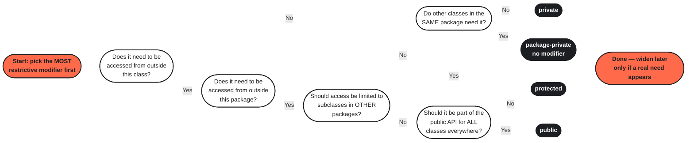

## 1. Classes & Objects

A **class** defines the state and behavior of a type.  
An **object** is an instance of that class.

>An **instance** is a specific **object created from a class**

```java
public class Car {

    private String color;
    private int speed;

    public Car(String color, int speed) {
        this.color = color;
        this.speed = speed;
    }

    public void accelerate(int amount) {
        speed += amount;
    }
}
```

Create an object:

```java
Car car = new Car("Red", 100);
car.accelerate(20);
```

### `this`

`this` refers to the current object.

```java
public Car(String color) {
    this.color = color;
}
```

Use constructors to ensure objects are created in a valid state.

---

## 2. Fields & Methods

> **State** in OOP means the **current data/values of an object at a particular point in time**.

**Fields** represent object state.

```java
private String username;
private boolean active;
```

**Methods** represent behavior.

```java
public void activate() {
    active = true;
}
```

Keep fields encapsulated and expose behavior through methods rather than allowing arbitrary modification.

```java
user.activate();       // Good
user.setActive(true);  // Sometimes appropriate
```

---

## 3. Encapsulation & Access Modifiers

Use access modifiers to control what other classes can access.

|Modifier|Accessible from|
|---|---|
|`private`|Same class|
|_(default)_|Same package|
|`protected`|Same package + subclasses|
|`public`|Everywhere|

A common production default is:

```java
public class User {

    private String username;

    public String getUsername() {
        return username;
    }
}
```

**Rule of thumb:** start with `private`. Expose only what other code actually needs.

This is **encapsulation**: hiding implementation details behind a controlled API.





---

## 4. Constructors

Constructors initialize objects.

```java
public User(String username) {
    this.username = username;
}
```

Overloading allows different construction paths:

```java
public User() {
}

public User(String username) {
    this.username = username;
}
```

In production code, prefer constructors that prevent invalid object states : 

```java
public User(String username) {
    if (username == null || username.isBlank()) {
        throw new IllegalArgumentException("username must not be null or blank");
    }
    this.username = username.trim();
}
```

---

## 5. `static`

`static` means the member belongs to the **class**, rather than an individual object.

```java
public class Counter {

    private static int count = 0;

    public static void increment() {
        count++;
    }
}
```

Usage:

```java
Counter.increment();
```

### Common uses

```java
Math.max(10, 20);       // static method
Integer.MAX_VALUE;      // static field
```

Static members are appropriate for **stateless utilities, constants, and class-level state**.

Avoid using `static` as a substitute for dependency injection or object design.

---

## 6. `final` & Immutability

`final` prevents reassignment, overriding, or inheritance depending on where it is used.

```java
final int MAX_RETRIES = 3;
```

```java
public final class SecurityConfig {
}
```

```java
public final void execute() {
}
```

### Constants

The common pattern is:

```java
public static final int MAX_RETRIES = 3;
```

### Immutable objects

```java
public final class User {

    private final String username;

    public User(String username) {
        this.username = username;
    }

    public String getUsername() {
        return username;
    }
}
```

Immutability makes state easier to reason about and can simplify concurrent code.

---

## 7. Records

For immutable data carriers, modern Java provides **records**.

```java
public record UserDto(
    Long id,
    String username
) {}
```

Java automatically provides:

- constructor
    
- accessors
    
- `equals()`
    
- `hashCode()`
    
- `toString()`
    

Usage:

```java
UserDto user = new UserDto(1L, "alireza");

user.id();
user.username();
```

Records are particularly useful for DTOs, API responses, and other data-carrier types.

---

## 8. Method Overloading

Methods can have the same name as long as their parameter lists differ.

```java
public void log(String message) {
}

public void log(String message, int level) {
}
```

This is **compile-time polymorphism**.

Don't overload methods merely because you can; use it when the operations represent the same conceptual behavior.

---

## 9. Packages

Packages organize classes and define an important part of Java's access-control boundary.

```java
package com.example.user;
```

A typical Spring Boot project might use:

```text
com.example.app
├── controller
├── service
├── repository
├── entity
├── dto
└── config
```

Import classes with:

```java
import java.util.List;
import com.example.app.service.UserService;
```

Avoid the default package in real projects.

### Static imports

```java
import static java.lang.Math.sqrt;

double result = sqrt(16);
```

Use them sparingly; excessive static imports can make code harder to understand.

---

## 10. Modern Java OOP Features

These are worth learning after the fundamentals:

### Records

```java
record Point(int x, int y) {}
```

### Sealed classes

Restrict which classes can extend a type:

```java
public sealed interface Payment
    permits CardPayment, CashPayment {
}
```

### Pattern matching

```java
if (payment instanceof CardPayment card) {
    card.process();
}
```

These features make Java's type system more expressive while preserving strong compile-time checking.

---

## Production Mental Model

When designing a class, ask:

```text
What state does this object own?
        ↓
What behavior belongs to it?
        ↓
What state should be private?
        ↓
How must the object be constructed?
        ↓
Should the object be mutable or immutable?
        ↓
Does this belong to an object or the class? → static
        ↓
Should this value/type be restricted? → final
        ↓
Who actually needs access to this class/member?
        ↓
Which package should own it?
```

### Production defaults

```java
private fields
        +
constructor-based initialization
        +
small focused methods
        +
encapsulation
        +
immutability where practical
        +
minimal public API
```

The goal isn't to memorize OOP keywords. The goal is to **design types whose state and behavior have clear ownership and controlled boundaries**.

[[Java]]

[Java Classes & Object](https://www.youtube.com/watch?v=IUqKuGNasdM)