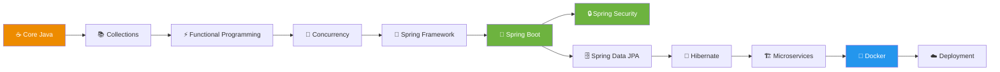

# 🧠 My Second Brain — Knowledge Vault

<div align="center">


**A meticulously organized personal knowledge base covering everything from Java fundamentals to System Design, DevOps, and Mindset.**

[📚 Explore Notes](#-vault-structure) • [🚀 Quick Start](#-quick-start) • [🗺️ Roadmap](#️-learning-roadmap) • [🤝 Contributing](#-contributing)

</div>

---

## 📖 About This Vault

Welcome to my **Digital Garden** 🌱 — a curated collection of **1,287+ markdown notes** organized across **77 directories**. This isn't just a note-taking repo; it's a **living knowledge system** built to master:

- ☕ **Java & Spring Ecosystem** (from Core Java to Spring Security & WebFlux)
- 🗄️ **Databases** (PostgreSQL, MongoDB, Redis, SQLite)
- 🧮 **DSA & Algorithms** (Java-based implementations)
- 🌐 **Networking & Computer Science Fundamentals**
- 🐳 **Docker, Git, Linux & CI/CD**
- 🧠 **Psychology & Mindset** (because soft skills matter!)

> *"The best way to learn is to teach, and the best way to remember is to write it down."*

---

## 🎨 Vault Highlights

<table>
<tr>
<td width="50%">

### ☕ Java Mastery
- Core Java Concepts (50+ notes)
- Collections & Generics
- Functional Programming & Streams
- Multithreading & Concurrency
- JVM Internals & Performance

</td>
<td width="50%">

### 🌱 Spring Ecosystem
- Spring Boot (Fat section!)
- Spring Security & JWT
- Spring Data JPA & Hibernate
- Spring WebFlux & Reactive
- Microservices & Cloud

</td>
</tr>
<tr>
<td width="50%">

### 🗄️ Databases
- PostgreSQL (150+ notes!)
- MongoDB
- Redis
- SQLite3 (CS50)
- JDBC, JPA, Hibernate

</td>
<td width="50%">

### 🛠️ DevOps & Tools
- Docker (Deep dive)
- Git (Internals + Practical)
- Linux Commands
- GitHub Actions (CI/CD)
- Maven & Gradle

</td>
</tr>
</table>

---

## 📂 Vault Structure

```
📦 My-Second-Brain
├── 📓 1 - Notes/
│   ├── ☕ A - Computer & Programming & Networking & CyberSecurity
│   │   ├── 💻 A - Programming
│   │   ├── 🌱 F2 - Spring Boot Framework
│   │   ├── 🔒 F3 - Spring Security
│   │   ├── 🌐 F - Spring Ecosystem
│   │   ├── 🗄️ G - DataBases
│   │   ├── 🎨 H - Algorithms & Design Patterns
│   │   ├── 🐳 I - Docker
│   │   ├── 🔧 J - Back-end
│   │   ├── 📝 K - Loggers
│   │   ├── 🐘 L - Hibernate
│   │   ├── 🏗️ M - System Design
│   │   ├── 🧪 N - Testing
│   │   ├── 🌐 O - HTTP
│   │   ├── 💛 P - JavaScript
│   │   ├── 🧠 Q - Java Rememberance
│   │   ├── 🖥️ R - Computer Science
│   │   ├── 🐧 F - Linux
│   │   ├── 🧮 G - DSA (Java)
│   │   ├── 🌐 K - NetWorking
│   │   └── 🎯 L - Real World Applications
│   ├── 🎯 2 - Core-concepts/
│   ├── 📋 3 - Dash/
│   │   ├── 📄 A - Templates
│   │   └── 🏷️ Tags
│   ├── 🖼️ 4 - Images/
│   ├── 🧪 5 - Worksheet/
│   ├── 🚀 6 - Real-Project/
│   │   └── 🎮 ArcadeSocial (WebSocket + STOMP)
│   ├── 🦠 7 - Infection/
│   ├── 🧠 C - Psychology/
│   ├── 💪 G - MindSet/
│   └── 🗑️ L - Language/
```

---

## 🚀 Quick Start

### 📥 Clone the Vault

```bash
git clone https://github.com/your-username/my-second-brain.git
cd my-second-brain
```

### 🧭 Navigation Tips

| Goal | Where to Look |
|------|---------------|
| ☕ Learn Java basics | `1 - Notes/A - Programming/D - Core Java Concepts` |
| 🌱 Master Spring Boot | `1 - Notes/A - Programming/F2 - Spring boot Framework` |
| 🔒 Secure your app | `1 - Notes/A - Programming/F3 - Spring Security` |
| 🗄️ Learn PostgreSQL | `1 - Notes/A - Programming/G - DataBases/1 - Postgresql` |
| 🐳 Dockerize apps | `1 - Notes/A - Programming/I - Docker` |
| 🧮 Practice DSA | `1 - Notes/A - Programming/G - DSA(Java)` |
| 🧠 Boost focus | `1 - Notes/G - MindSet/Brain and Functions` |

---

## 🗺️ Learning Roadmap



---

## 🌟 Featured Sections

### 🎮 ArcadeSocial — Real Project
A real-world social app built with:
- **WebSockets** + **STOMP Protocol**
- `@MessageMapping`, `@SendTo`, `SimpMessagingTemplate`
- Event-driven architecture with `@EventListener`

### 🧠 MindSet & Psychology
Because a great developer needs a great mind:
- 🧬 Human Memory & Focus Protocols
- 📱 Social Media & The Brain
- 🚀 Fast Mode & Attention Span
- 🧘 Posture & Confidence

### 🧪 Worksheet & Mistakes
- CAS in Atomic Classes
- IntStream → Stream conversions
- My Mistakes in Action (learning from errors!)

---


## 📊 Vault Statistics

<div align="center">

| 📝 Notes | 📁 Directories | 🖼️ Images | 🎯 Topics |
|:--------:|:--------------:|:---------:|:---------:|
| **1,287+** | **77** | **150+** | **25+** |

</div>

---

## 🤝 Contributing

This is a **personal knowledge vault**, but contributions are welcome!

1. 🍴 Fork the repo
2. 🌿 Create a feature branch (`git checkout -b feature/amazing-note`)
3. ✍️ Write your note (use templates in `3 - Dash/A - Templates`)
4. ✅ Commit (`git commit -m 'Add amazing note'`)
5. 🚀 Push (`git push origin feature/amazing-note`)
6. 🎉 Open a Pull Request

---

## 📜 License

This project is licensed under the **MIT License** — feel free to learn, share, and grow! 🌱

---

<div align="center">

### ⭐ If this vault helped you, give it a star!

**"Knowledge grows when shared."** 🧠✨


Made with ❤️ and ☕ by a passionate Java Developer

</div>